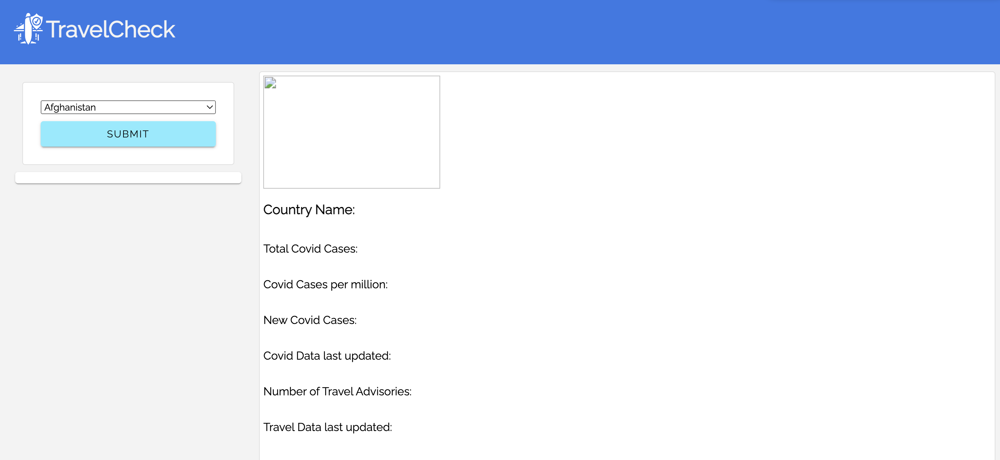
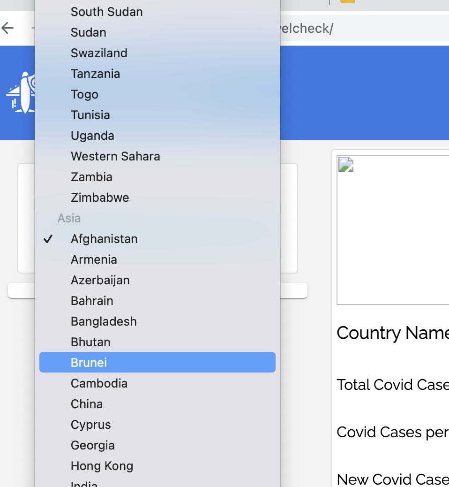
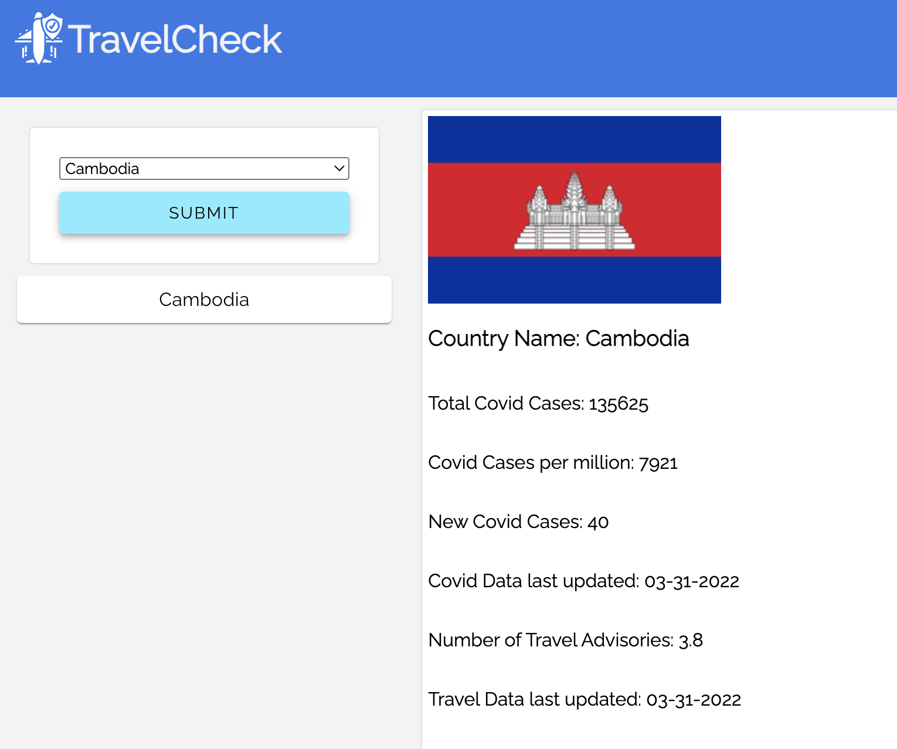
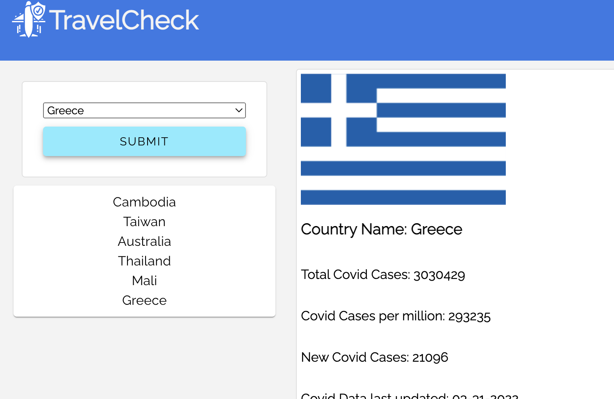

# TravelCheck
A simple and intuitive world travel advisory application to help world travelers determine if their destination is safe to travel to.

## Description

As someone who intends to travel internationally, I want to be able to access real-time information on the condition of potential destinations, especially in regard to potential risks that I might not be aware of, especially in regards to COVID-19. As a result, I’m capable of making informed decisions on where and when I should travel in the future.

## Usage

This application can be found that the following [link](https://qkeddy.github.io/travelcheck/).

When you first arrive on the page, there will be a country dropdown and a submit button.

To get COVID-19 and travel safety data for a specific country, select the country you want from the dropdown and click submit. Countries are listed by continent and then in alphabetical order.

After clicking submit, data for the country that you input will be displayed on the screen and that country will appear in left-hand column under that submit button.

As you continue to search for countries, TravelCheck will store your search history in the left-hand column. Simply click on the country name to view a country that you have already searched. Your search history will be stored in local storage, so you can feel free to leave and return to this page without losing your search history.

## Credits

### List of Collaborators
* Quin Eddy [(Github)](https://github.com/qkeddy)
* Augustus Madden [(Github)](https://github.com/AugustusMadden)
* Carol Tsai [(Github)](https://github.com/carol-tsai)

### This application will use the following open APIs and CSS frameworks:

* [Travel Advisory API](https://www.travel-advisory.info/)
* [COVID-10 Data API](https://disease.sh/)
* [Material (CSS framework)](https://material.io/)
* [Moment.js](https://momentjs.com/)
* [Google Fonts](https://fonts.google.com/)

### Reference Documents

* [Travel Advisory API Documentation](https://www.travel-advisory.info/data-api) 
* [COVID Data API documentation](https://disease.sh/docs/)
* [Material.io Documentation](https://m3.material.io/foundations/glossary)
* [w3schools Optgroup Documentation](https://www.w3schools.com/tags/tag_optgroup.asp)

## License

MIT License

Copyright (c) 2022 Augustus Madden, Carol Tsai, Quin Eddy

Permission is hereby granted, free of charge, to any person obtaining a copy
of this software and associated documentation files (the "Software"), to deal
in the Software without restriction, including without limitation the rights
to use, copy, modify, merge, publish, distribute, sublicense, and/or sell
copies of the Software, and to permit persons to whom the Software is
furnished to do so, subject to the following conditions:

The above copyright notice and this permission notice shall be included in all
copies or substantial portions of the Software.

THE SOFTWARE IS PROVIDED "AS IS", WITHOUT WARRANTY OF ANY KIND, EXPRESS OR
IMPLIED, INCLUDING BUT NOT LIMITED TO THE WARRANTIES OF MERCHANTABILITY,
FITNESS FOR A PARTICULAR PURPOSE AND NONINFRINGEMENT. IN NO EVENT SHALL THE
AUTHORS OR COPYRIGHT HOLDERS BE LIABLE FOR ANY CLAIM, DAMAGES OR OTHER
LIABILITY, WHETHER IN AN ACTION OF CONTRACT, TORT OR OTHERWISE, ARISING FROM,
OUT OF OR IN CONNECTION WITH THE SOFTWARE OR THE USE OR OTHER DEALINGS IN THE
SOFTWARE.

## How to Contribute

Please reach out to one of the people from the list of collaborators if you would like to contribute to this project.

We ask that all contributors adhere to the standards outined in the [Contributor Covenant Code of Conduct](https://www.contributor-covenant.org/version/2/1/code_of_conduct/)
